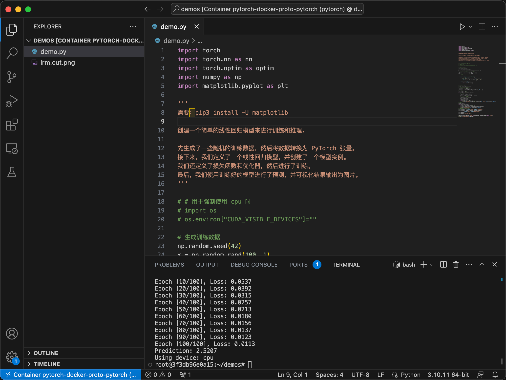

# PyTorch Docker proto

在本地通过 docker 环境开发 pytorch 项目的环境:

- macOS
- pytorch with cpu 

使用 [cnstark/pytorch-docker](https://github.com/cnstark/pytorch-docker) 为基础实现定制docker镜像。

启动容器：

```bash
# 构建和启动镜像
docker compose up -d
```

vscode 安装 docker 扩展。

在 docker 扩展界面找到启动的容器，attach 到容器中，就可以开发了。

